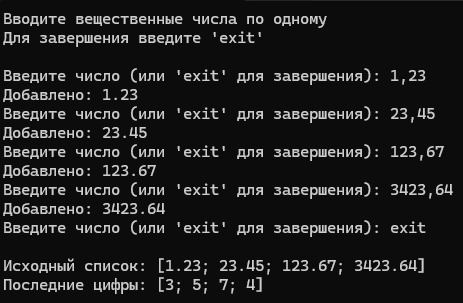

# Красных Александр ИТС-2 Лабораторная №2

# Задание 1

### Текст задачи

На основе списка вещественных чисел получить список из их последних цифр.

### Алгоритм решения

1. Для начала нужно реализовать функцию getLastDigit, которая будет
преобразовывать вещественное число в строку и получать ее последний символ
после чего вновь возвращать букву в число.
2. Следующим шагом необходимо readNumbersTailRec для рекурсивной
хвостовой записи в список значений последних цифр которые мы получаем из
вышеописанной функции.
3. Затем строим простенькое основное тело программы, оно будет отвечать
за создание пустого списка, большую часть пользовательского интерфейса и
вызов функции getLastDigit

### Тестирование

# Задание 2

### Текст задачи

Найти произведение нечётных цифр натурального числа.

### Алгоритм решения

1. Запрос исходного числа от пользователя
2. Вызов функции умножения нечетных цифр числа
3. При попадании числа в функцию оно разбивается посимвольно и каждый символ по очереди проверяется на четность,
   если число нечетное оно попадает в искомое произведение и функция рекурсивно переходит к следующему значению. В ином случае функция сразу рекурсивно
   переходит к следующему символу числа и повторяется пока все цифры не будут обработаны
5. Вывод результата работы вышеописанной функции

### Тестирование

# Задание 3

### Текст задачи

Создайте собственные функции для выполнения основных операций над списками (добавление/
удаление/поиск элемента, сцепка двух списков, получение элемента по номеру).

### Алгоритм решения

1. Запрос вводных данных
2. Поочередное обращение к нижеописанным функциям
3. функция создания списка работает с помощью рекурсивного вызова самой себя до тех пор пока не будет введено пустое значение
4. функция добавления элемента в список создает другой список элементами которого является добавляемое значение + исходный список
5. функция удаления элемента работает на рекурсивном поиске искомого значения вызывая сама себя если значения не найдено заменяя исходный список на его хвост
6. функция сращивания списков использует встроенный функционал F# и сращивает 2 списка с помощью команды &
7. функция поиска по значению элемента работает через функционал сравнения паттерна match, она ищет совпадение пока не дойдет до конца списка либо не найдет само совпадение
8. функция поиска по индексу элемента выводит элемент с помощью свойства типа данных list - list.item
9. Проверка каждой написанной функции

### Тестирование

