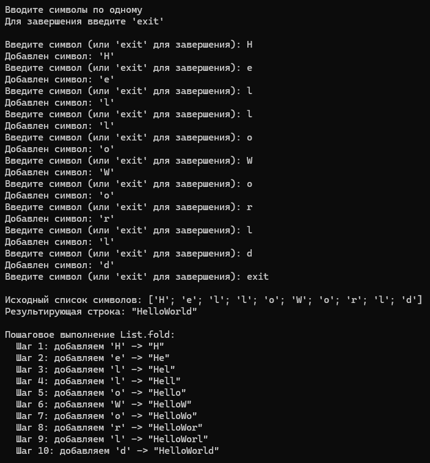

# Красных Александр ИТС-2 Лабораторная №2

# Задание 1

### Текст задачи

На основе списка вещественных чисел получить список из их последних цифр.

### Алгоритм решения

1. Для начала нужно реализовать функцию getLastDigit, которая будет
преобразовывать вещественное число в строку и получать ее последний символ
после чего вновь возвращать букву в число.
2. Следующим шагом необходимо readNumbersTailRec для рекурсивной
хвостовой записи в список значений последних цифр которые мы получаем из
вышеописанной функции.
3. Затем строим простенькое основное тело программы, оно будет отвечать
за создание пустого списка, большую часть пользовательского интерфейса и
вызов функции getLastDigit.
4. Теперь тестируем и отлаживаем готовую программу.

### Тестирование

# Задание 2

### Текст задачи

Список содержит символы. Составить из них строку.

### Алгоритм решения

1. Для начала напишем функцию readCharsTailRec для хвостовой
рекурсии реализующей ввод данных с клавиатуры. Также она проверяет
корректность вводимых данных.
2. Написать кусочек главной программы содержащий пользовательский интерфейс,
начальный пустой список, вызов нашей функции и соответственно необходимый нам
list.fold.
3. Теперь тестируем и отлаживаем готовую программу.

### Тестирование

